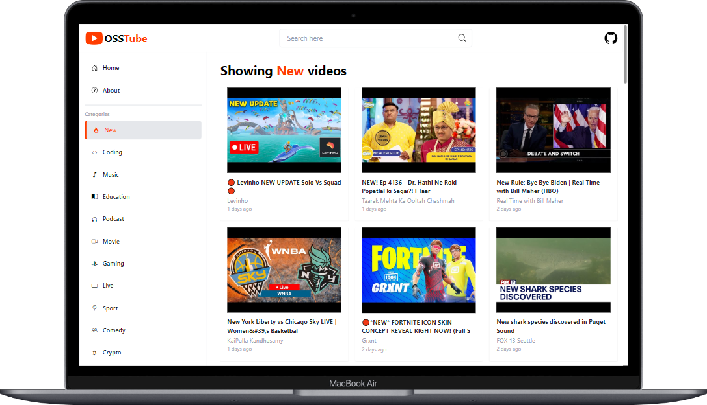
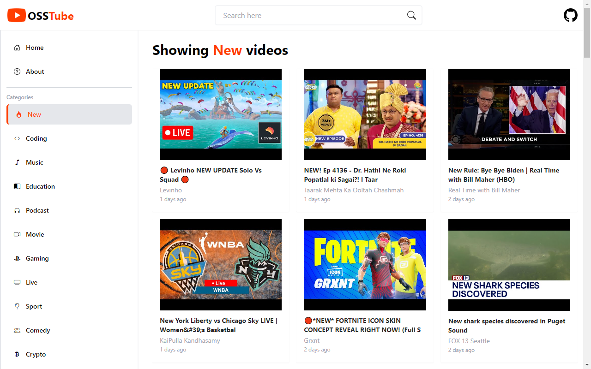

# OSSTube - YouTube 2.0




> This is a YouTube clone built using React, Tailwind CSS, and the YouTube Data API (v3) from RapidAPI. It features displaying videos with categories, a responsive design, modals displaying video details, and the option to redirect to YouTube to play the video.

---

## Table of Contents

- [Demo](#demo)
- [Features](#features)
- [Installation](#installation)
- [Usage](#usage)
- [API Key](#api-key)
- [Contributing](#contributing)
- [License](#license)

---

## Demo




---

## Features

- **Video Display**: Display videos from YouTube using the YouTube Data API.
- **Categories**: Categorize videos based on their metadata.
- **Responsive Design**: Fully responsive UI using Tailwind CSS.
- **Modal Popups**: Display additional information about each video in a modal.
- **External Link**: Redirect users to YouTube to play the selected video.

---

## Installation

To run this project locally, follow these steps:

1. Clone the repository:

   ```bash
   git clone https://github.com/your-username/your-repository.git
   ```

2. Navigate into the project directory:

   ```bash
   cd your-repository
   ```

3. Install dependencies using npm:

   ```bash
   npm install
   ```

---

## Usage

1. Obtain a YouTube Data API key from [RapidAPI](https://rapidapi.com/marketplace).
2. Create a `.env` file in the root of the project and add your API key:

   ```plaintext
   REACT_APP_YOUTUBE_API_KEY=your-api-key-here
   ```

3. Start the development server:

   ```bash
   npm start
   ```

4. Open your browser and visit `http://localhost:3000` to view the app.

---

## API Key

This project uses the YouTube Data API (v3) to fetch videos. You need to provide your own API key to retrieve data from YouTube. Get your API key from [RapidAPI](https://rapidapi.com/marketplace).

---

## Contributing

Contributions are welcome! Here's how you can contribute to this project:

1. Fork the repository.
2. Create a new branch (`git checkout -b feature/improvement`).
3. Make your changes.
4. Commit your changes (`git commit -am 'Add some feature'`).
5. Push to the branch (`git push origin feature/improvement`).
6. Create a new Pull Request.

---

## License

This project is licensed under the MIT License. See the [LICENSE](./LICENSE) file for more details.

---

### Acknowledgements

- **React**: A JavaScript library for building user interfaces.
- **Tailwind CSS**: A utility-first CSS framework for building custom designs.
- **YouTube Data API**: Provides access to YouTube videos, playlists, and channels.


